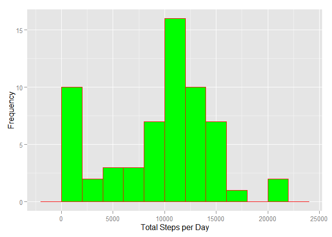
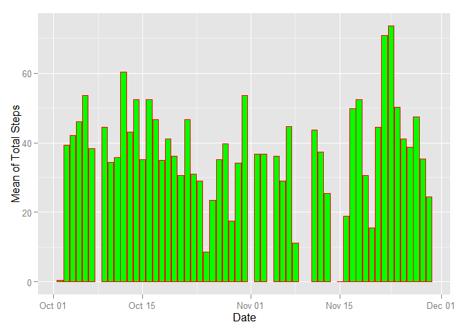
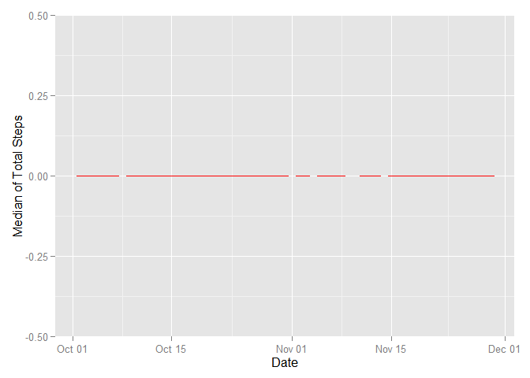
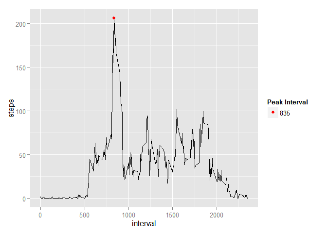
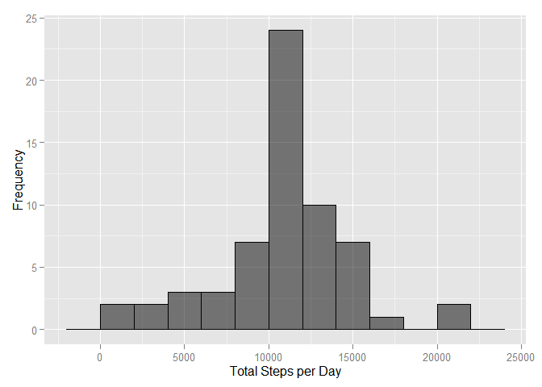
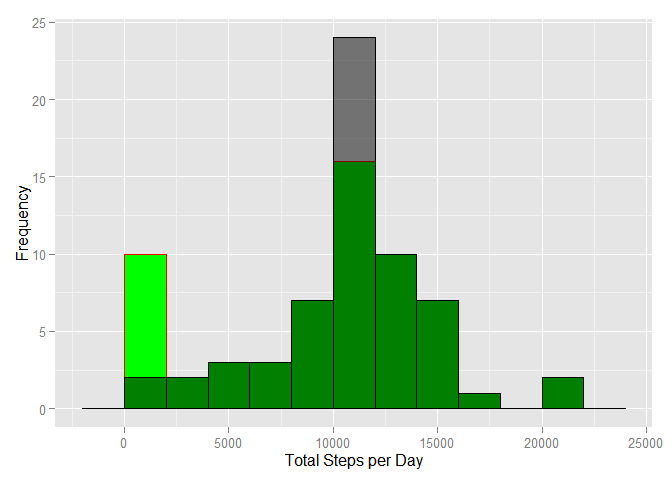
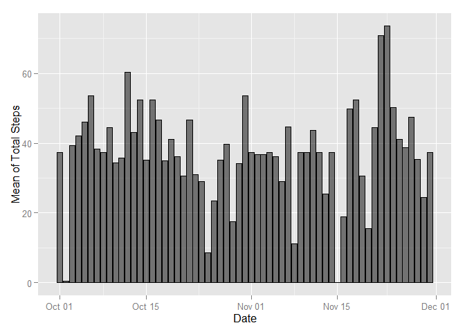
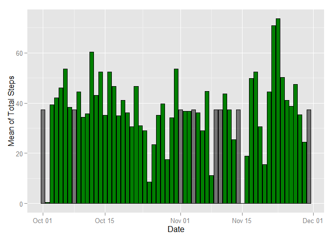
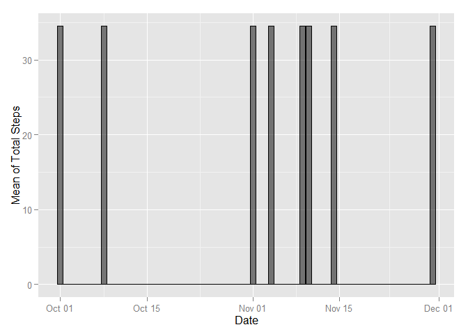

This document is my submission for Course Project 1 on the Reproducible
Research module.

Loading and preprocessing the data
----------------------------------

First let's check whether the working directory contains the data file
and if not, then download it from it's original web URL and extract the
.zip file.

    if ("activity.csv" %in% dir() == FALSE) {
    download.file("https://d396qusza40orc.cloudfront.net/repdata%2Fdata%2Factivity.zip","activity monitoring data.zip")
    unzip("activity monitoring data.zip")
    }

Next, we read in the activity.csv file and transform the dates into a
valid date format using the lubridate package.

    activity <- read.csv("activity.csv")
    library(lubridate)
    activity$date <- parse_date_time(as.character(activity$date),"Ymd")

What is mean total number of steps taken per day?
-------------------------------------------------

First, we group the dataset by the date field using dplyr package. Then
we summarise the total steps  
per day (ignoring missing values) and create a histogram of the summary
data by using the ggplot 2 package.

    library(dplyr)
    library(ggplot2)
    activity_bydate <- activity %>% group_by(date)
    total1 <- activity_bydate %>% summarise(steps_total=sum(steps,na.rm=TRUE))
    hist1 <- ggplot(total1, aes(steps_total)) +
                            geom_histogram(binwidth=2000, 
                                    col="red", 
                                    fill="green") +
                            labs(x="Total Steps per Day", y="Frequency") 
    plot(hist1)

<!-- -->
Second, we caculate and plot the mean and median of the total steps per
day. For now, we ignore missing values.

    mean1 <- activity_bydate %>% summarise(steps_mean=mean(steps,na.rm=TRUE))
    median1 <- activity_bydate %>% summarise(steps_median=median(steps,na.rm=TRUE))

    plot_mean1 <- ggplot(mean1, aes(date, steps_mean)) +
                    geom_bar(stat = "identity",fill="green", col="red") +
                    labs(x="Date", y="Mean of Total Steps")

    plot_median1 <- ggplot(median1, aes(date, steps_median)) +
                     geom_bar(stat = "identity",fill="green",col="red") +
                    labs(x="Date", y="Median of Total Steps")
    plot(plot_mean1)

<!-- -->

    plot(plot_median1)

<!-- -->

What is the average daily activity pattern?
-------------------------------------------

First, we group the data by intervals. Then we calculate a summary for
the intervals showing the average number of steps taken for the given
interval as averaged across all the days. Then we plot the results and
highlight the interval with the maximum amount of average steps. The
interval's ID number is displayed in the graph legends.

    interval_group <- activity %>% group_by(interval)
    interval_avg <- interval_group %>% summarise(steps=mean(steps,na.rm=TRUE))
    maximum <- interval_avg[interval_avg$steps== max(interval_avg$steps),]

    cols2 <- c("A" = "red")
    max_value <- as.character(maximum$interval)
    names(cols2) <- max_value

    plot <- ggplot(interval_avg, aes(interval, steps))
    plot + geom_line(stat = "identity") +
    geom_point(aes(x=maximum$interval,y=maximum$steps,color=max_value),size=2) +
    scale_colour_manual(name="Peak Interval",values = cols2)

<!-- -->

Imputing missing values
-----------------------

First, we calculate and report the number of missing values in the
dataset.

    missing <- activity[is.na(activity$steps == TRUE),]
    missing_count <- nrow(missing)

The number of rows with NAs is **2304**.

Second, we will fill in the missing values. As a substitue, whenever the
steps value is missing, we are going to replace NA with the rounded
average number of steps for that given interval as averaged across all
days. We do this with a for loop. Then we create a new activity2 dataset
that uses the substituted values.

    for (i in 1:missing_count) {
            missing$steps[i] <- round(interval_avg$steps[interval_avg$interval == missing$interval[i]])
    }
    activity2 <- activity[!is.na(activity$steps == TRUE),]
    activity2 <- rbind(activity2,missing)

And third, we use the new dataset and create a historam a histogram of
the total number of steps taken each day and also calculate and report
the mean and median total number of steps taken per day.

    activity2_bydate <- activity2 %>% group_by(date)
    total2 <- activity2_bydate %>% summarise(steps_total=sum(steps,na.rm=TRUE))
    hist2 <- ggplot(total2, aes(steps_total)) +
            geom_histogram(binwidth=2000, 
                           col="black", 
                           fill="black",alpha=0.5) +
            labs(x="Total Steps per Day", y="Frequency") 
    plot(hist2)

<!-- -->

Now let's compare the two histograms in a single plot. The old histogram
is plotted in green colour and red border; whereas the new historgam is
displayed dark gray color and black border. Overlapping areas will be
shown as a dark grey.

    hist_compare <- ggplot(total1, aes(steps_total)) +
            geom_histogram(binwidth=2000, 
                           col="red", 
                           fill="green",alpha=1) +
            geom_histogram(data=total2,aes(steps_total),binwidth=2000, 
                           col="black", 
                           fill="black",alpha=0.5) +
            labs(x="Total Steps per Day", y="Frequency") 
    plot(hist_compare)

<!-- -->

As we can see, the main impact of the imputation was that the frequency
of the lower values dropped significantly; whilst the frequency of the
central values increased.

Let's also plot and compare in a similar fashion the mean and median
total steps per days. First, let's plot the new mean and median stats
individually.

    mean2 <- activity2_bydate %>% summarise(steps_mean=mean(steps,na.rm=TRUE))
    median2 <- activity2_bydate %>% summarise(steps_median=median(steps,na.rm=TRUE))

    plot_mean2 <- ggplot(mean2, aes(date, steps_mean)) +
            geom_bar(stat = "identity",fill="black",alpha=0.5,col="black") +
            labs(x="Date", y="Mean of Total Steps")

    plot_median2 <- ggplot(median2, aes(date, steps_median)) +
            geom_bar(stat = "identity",fill="black",alpha=0.5,col="black") +
            labs(x="Date", y="Median of Total Steps")

    plot(plot_mean2)

<!-- -->

    plot(plot_median2)

<!-- -->

And now let's do the comparisons. The old-new distinction is represented
in the same way as in case of the histrogram comparison.

    plot_mean_comparison <- ggplot(mean1, aes(date, steps_mean)) +
            geom_bar(stat = "identity",fill="green",col="green") +
            geom_bar(data=mean2,aes(date,steps_mean),stat="identity",fill="black",alpha=0.5,col="black")+
            labs(x="Date", y="Mean of Total Steps")
            
    plot(plot_mean_comparison)

    ## Warning: Removed 8 rows containing missing values (position_stack).

<!-- -->

As indicated, the main difference is that the imputed values filled up
the gaps in the distribution chart.

If we compare the median stats in the same way, we will see this even
more drammatically as previously there were no non-zero values.

    plot_median_comparison <- ggplot(median1, aes(date, steps_median)) +
            geom_bar(stat = "identity",fill="green",col="green") +
            geom_bar(data=median2,aes(date,steps_median),stat="identity",fill="black",alpha=0.5,col="black")+
            labs(x="Date", y="Mean of Total Steps")
            
    plot(plot_median_comparison)

    ## Warning: Removed 8 rows containing missing values (position_stack).

<!-- -->

Are there differences in activity patterns between weekdays and weekends?
-------------------------------------------------------------------------

In the last task, we create a new factor variable in the imputed dataset
with two levels – “weekday” and “weekend” indicating whether a given
date is a weekday or weekend day.

    activity2$day <- sapply(activity2$date, function(f) {weekdays(f)})
    activity2$weekday <- sapply(activity2$day, function(g) {
            if (g == "Saturday" | g == "Sunday") {
                    g <- 'Weekend'}
                    else {g <- "Weekday"}
                    })

    activity2$weekday <- as.factor(activity2$weekday)

After that, we group the data by the weekdday variable and the intervals
and create a summary of the average of this grouped data.

    interval_group2 <- activity2 %>% group_by(weekday,interval)
    interval_avg2 <- interval_group2 %>% summarise(steps=mean(steps,na.rm=TRUE))

Finally, we create a faceted time-series plot of the intervals and and
average number of steps taken, averaged across weekdays and weekends.

    timeseries <- ggplot(interval_avg2, aes(interval, steps,weekday))+
            geom_line(stat = "identity") +
            facet_grid(weekday ~ .)
    plot(timeseries)

<!-- -->
